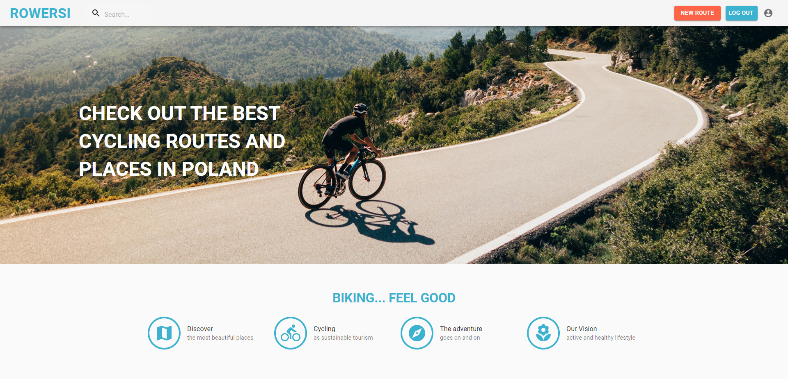

# :bike: ROWERSI - Check out the best cycling routes and places in Poland

### Index of Contents

- [Introduction](#introduction)
- [Back-end](#back-end)
- [Enviroment](#enviroment)
- [Workflow](#workflow)
- [Our Team](#our-team)
- [Setup](#setup)
- [Thanks a Lot](#thanks-a-lot)

### Introduction

Our application was created to promote cycling as a form of sustainable tourism and to encourage an active and healthy lifestyle.
Our goal is to promote the best bicycle routes and places in Poland among Polish and foreign cyclists.

The application allows its logged in users to create personalized bicycle routes. The user can add photos from the cycling route, description, title and select the region where the route is located. It is also possible to add additional points along the route, e.g. interesting landscape spots, accommodation or eating spots.

Each visitor can view the added routes, and has access to information added by other users, checking the rating of the route, description, etc. However, non-logged in users cannot add such routes.

### Back-end

Our team used Firebase to create connections between the database and application.
Cloud Firestore is a highly scalable, cloud hosted, NoSQL realtime database, which helped us to store, sync, and query data for our web application.
We used Firebase Authentication to let our users authenticate with Firebase using their email addresses and passwords.

### Enviroment

ROWERSI app is making use of ReactJS.
To cut a long story short, React is a JavaScript library for building User Interfaces.

Linking within the application uses React Router.

To make our application look nice and modern, we decided to use MATERIAL UI. Working in a group, we found this to be the safest way to make our application design consistent.
However, standard Material UI style is a big limitation and that's why we decided to use Material UI custom styles using makeStyles.

Our team implemented various functions using React Hooks, including useState, useEffect, useContext, useDropzone.

To make our application more attractive, we also used several animated elements, such as Modal Boxes for login and sign up, useLayoutEffect (region cards), animated text on hero banner and slider (photo gallery for the route).

However, our most important element is Mapbox. We were able to integrate custom live maps and location search into our web app with Mapbox APIs.

### Workflow

Our work was based on the Scrum methodology. We used Jira to create and manage tasks.
It took some time to learn to use the benefits of this platform, and today we are familiar with concepts such as backlog, sprints and sprint retrospective.
Slack was also very useful in Daily Scrum. We tried to define our daily tasks and, if necessary, ask our mentors for advice.

### Our Team

We are pleased to present the ROWERSI Team:

:heavy_check_mark: [Karol Ciolczyk](https://github.com/karol-ciolczyk)
:heavy_check_mark: [Ilona Kozak](https://github.com/ilonakozak)
:heavy_check_mark: [Michal Lachowski](https://github.com/Michal-Lachowski)
:heavy_check_mark: [Adam Szumski](https://github.com/AdamSzumski)

### Setup

Clone this repo and run `$ npm install` to install all dependecies.

### Thanks a Lot

This project was supervised by the <a href="https://github.com/infoshareacademy">infoShare Academy</a>.
